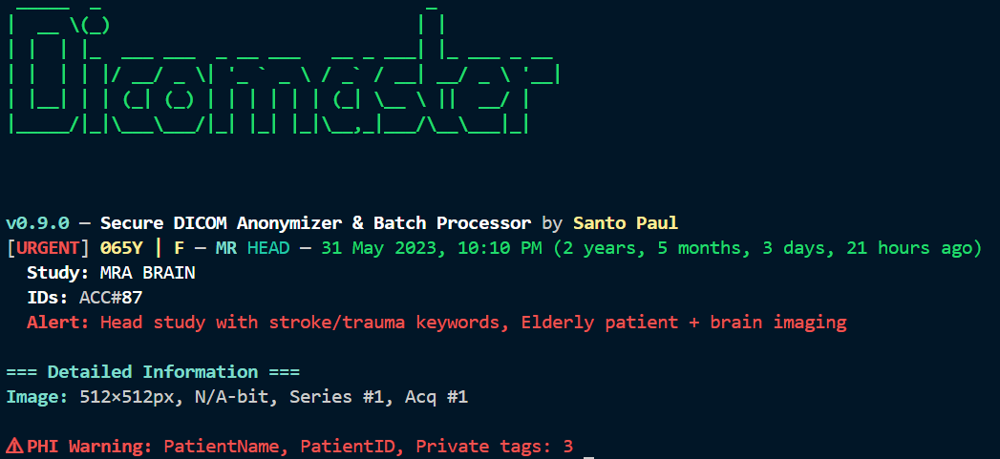
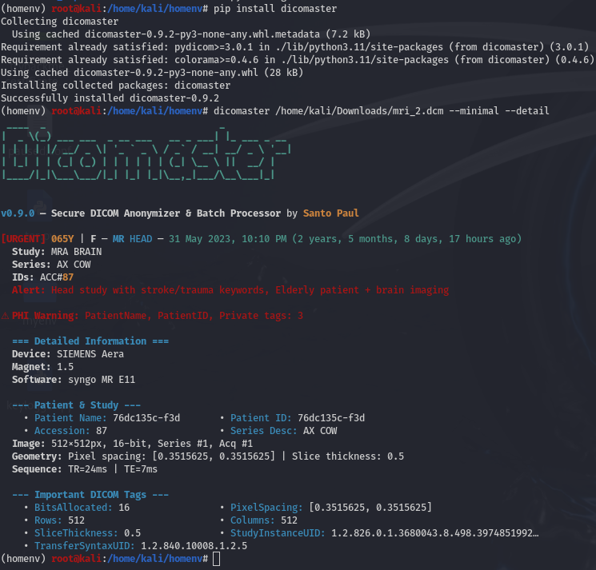
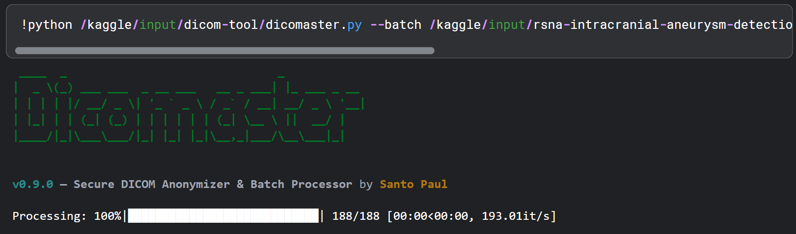

# Dicomaster  
**Secure, High-performance DICOM anonymization and metadata extraction for research and healthcare.**  

[](https://badge.fury.io/py/dicomaster) 
[](https://opensource.org/licenses/MIT) 
[](https://github.com/santopaul/dicomaster/actions)
[](https://github.com/santopaul/dicomaster/stargazers)

---
> “Every byte of data represents a life worth protecting.” — *Santo Paul*
---



### **TL;DR**

[**Dicomaster**](https://github.com/santopaul/dicomaster) is a fast, secure, and clinician-friendly DICOM processor that makes handling medical images effortless.  
It extracts metadata, anonymizes PHI, batches conversions, and outputs AI-ready formats (CSV, JSON, FHIR, images) while maintaining patient confidentiality.

### **Why did I build this?**

The idea for this tool started when I jumped into Kaggle's [**RSNA Intracranial Aneurysm Detection challenge**](https://www.kaggle.com/competitions/rsna-intracranial-aneurysm-detection). Those .dcm files of CTA, MRA, MRI were overwhelming. Manual preprocessing was slow, and PHI leaks could ruin patient trust (and cost hospitals millions). I built **Dicomaster** to fix that: a fast, secure, clinician-friendly CLI to extract metadata, anonymize data, and prep multimodal imaging for AI models while keeping patients safe. Brain aneurysms hit 3% of us, kill 500,000 yearly, and half are under 50. My tool's here to help catch them early, whether for Kaggle or real-world radiologists.

I saw those DICOM files on Kaggle and thought, **_"There's gotta be a better way."_** Prepping data for aneurysm detection shouldn't be a slog - it should be fast, safe, and ready for AI or hospital EHRs. I wanted a tool that:

- **Protects Patients:** Strips PHI with military-grade PBKDF2 (100k iterations, better than [deid's](https://github.com/pydicom/deid) basic hashing).
- **Powers Kaggle:** Processes 10k+ files in minutes, with streaming outputs for TCIA datasets.
- **Helps Clinicians:** Flags urgency keywords like "aneurysm" or "stroke."
- **Fits Hospitals:** Exports **FHIR**, supports **HIPAA/GDPR compliance**, and logs all anonymization maps.

### **Core Features ⚙**

#### **Metadata Extraction**

- STAT summaries (patient ID, modality, study date)
- Full technical metadata (--detail, --full)
- Private tag listings with optional PHI display (--show-private-values)

#### **Anonymization**

- \--anonymize or tag-specific via --anonymize-tags
- Modes: pseudonymize (PBKDF2/HMAC) or remove
- Auditable pseudonym maps (--anonymize-map)
- Secure salt control (--anonymize-salt)

#### **Batch Processing**

- \--batch for recursive folder scanning
- Multi-threaded (--threads, CPU adaptive)
- Progress-safe streaming no memory spikes
- \--max-depth, --timeout, and --dry-run for control

#### **Output Formats**

- \--output: json, csv, html, fhir, report, thumbnail, or aggregated (agg-csv, agg-json)
- \--output-dir to route results
- \--no-overwrite for data safety

#### **UX & CLI**

- \-v / --verbose for rich logs
- \-q / --quiet to disable banners
- \--no-banner for automation
- \--export-schema for Kaggle-style CSVs
- \--check-deps to verify optional dependencies
- **AI-Enabled:** Schema exports for YOLO or CNN training, urgency flags to prioritize critical cases.

### **Setup**

**Quick Install**
```
pip install dicomaster # Download Pypi version

dicomaster --check-deps # Make sure every dependencies required are installed
```


Always creating a virtual environment is recommended.

Or install using github
```
git clone <https://github.com/santopaul/dicomaster.git>

cd dicomaster

pip install -e .\[full\] # Full deps

python dicomaster.py --check-deps # Verify setup
```

### **Usage examples**

#### **Interactive Mode**

Ideal for quick exploration or one-off checks, automatically drops you into an interactive REPL when no arguments are passed.
```
python dicomaster.py
```
Once inside, simply enter file paths when prompted.

Or, for direct inspection with detailed metadata:
```
python dicomaster.py sample.dcm --minimal --detail
```
#### **Batch Processing**

For large-scale research datasets (e.g., RSNA or TCIA collections), **Dicomaster** can process entire folders recursively which is fast and secure.
```
python dicomaster.py --batch /kaggle/input/rsna-intracranial-aneurysm-detection/series/1.2.826.0.1.3680043.8.498.10004044428023505108375152878107656647 -o agg-csv -t 8
```


The screenshot above shows **Dicomaster** processing ~200 files in seconds, thanks to its optimized batch engine and threaded design.

#### **Batch Anonymization**

Perform bulk anonymization while exporting **combined metadata** (agg-csv) and **FHIR data** for AI or EHR pipelines.
```
python dicomaster.py --batch /data/tcia -o agg-csv,fhir --anonymize --anonymize-salt mysecret --threads 8
```
- Uses PBKDF2 pseudonymization for PHI tags
- Exports FHIR bundles compatible with hospital systems
- Generates AI-ready metadata (combined_metadata.csv)

### **Security notes**

- Always provide a --anonymize-salt for consistent pseudonyms across runs.
- If cryptography is installed, PBKDF2HMAC (100k+ iterations) is used; otherwise, it falls back to HMAC-SHA256.
- Random salts are generated when none is provided, but never printed in logs.
- Audit trails are preserved in anonymize maps (--anonymize-map).

### **Contributing**

- Fork and open a PR - add features, improve performance, or write tests
- Follow [PEP8](https://peps.python.org/pep-0008/) (black formatter recommended)
- Open issues - let's solve medtech pain points

### **License & Acknowledgements**

MIT License. (free to use and modify, but **protect PHI responsibly!**)

Built on top of:

- [pydicom](https://github.com/pydicom/pydicom)
- [cryptography](https://github.com/pyca/cryptography)
- pandas, PIL, tqdm, dateutil
- Inspired by [**deid**](https://pydicom.github.io/deid/), [**fast.ai**](https://docs.fast.ai/) and the **Kaggle community.**

### **Future Plans 🚀**

If **Dicomaster** gains traction, user adoption, and community love, I plan to extend it into a full ecosystem.

- **Web App & Dashboard:** A secure browser-based interface to upload, anonymize, visualize, and flag DICOMs, built for clinicians and researchers.
- **Hospital-Grade Platform:** Enterprise-ready version with encryption, audit trails, role-based access, and full HIPAA/GDPR compliance.
- **AI Integration**: Add trained models for disease prediction (aneurysm, hemorrhage, tumors) with automatic risk scoring and diagnostic insights.
- **Cloud Deployment:** Dockerized setup for hospitals, research labs, or Kaggle workflows - scalable and private.
- **Smart Data Explorer:** Search and visualize DICOM tags (like attending physician, modality, or study date) across large datasets.
- **API + Plugin System:** Expose REST endpoints and allow developers to add modules (e.g., radiomics, segmentation, or custom anonymization).
- **Education & Community Hub:** Tutorials, open-source AI pipelines, anonymization templates, and contributions from medical AI enthusiasts.

### **Let's build this together 🤝😊**

I'd love to hear your thoughts!  
If you've tried **Dicomaster**, or if you're into data science, medical AI, or DICOM workflows, Please let me know what you think.  
What worked for you? What do you wish existed next?

Every bit of feedback, idea, or story helps shape where this project goes next.

Let's make something incredible together! 🦾

### **From My Heart ❤️**

I built [**Dicomaster**](https://github.com/santopaul/dicomaster) because I believe AI and imaging should save lives - not just crunch data.  
I've always admired the work of [Jeremy Howard](https://github.com/jph00) and [**Fast.ai**](https://www.fast.ai/), who taught me that powerful tools don't have to be complicated to be life changing.  
That same philosophy inspired **Dicomaster** - bringing accessibility, security, and innovation to medical imaging.  
I truly hope this is the start of something big.

⭐[**Star the repo**](https://github.com/santopaul/dicomaster) if you believe medical AI deserves better tools.

---
Made with ❤️ by Santo Paul

📦 PyPI: pip install dicomaster

🌐 GitHub: [santopaul/dicomaster](https://github.com/santopaul/dicomaster)

✍️ Medium: @santopaul
